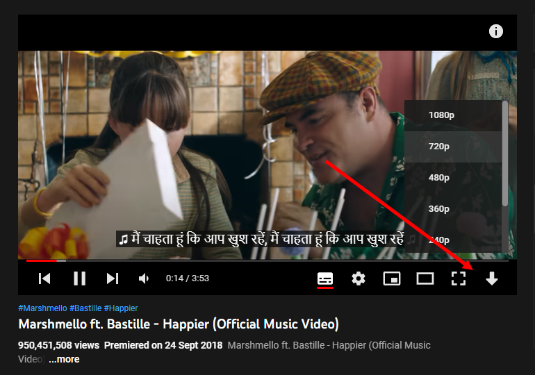
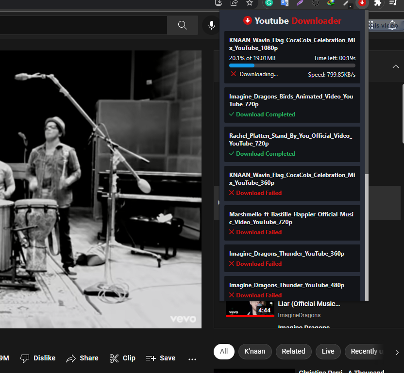

  

<h1 align="center"> Next Downloader </h1>

  <b >It's a NodeJs app and a browser extension to download youtube videos</b>

 

## Description
Download youtube videos without any problem and It's pretty simple. It uses [ytdlp](https://github.com/yt-dlp/yt-dlp) for downloading videos, [FFmpeg](https://ffmpeg.org) to merge audio & video, and a browser extension used to communicate with the browser.

Features:

* You can download youtube in any format.
* You can download multiple videos. It will download one by one.

Next features:

* Download entire playlist with a single click.

<a href="https://nextdownloader.web.app/">
Visit Website
</a>

### ScreenShots

 
 

